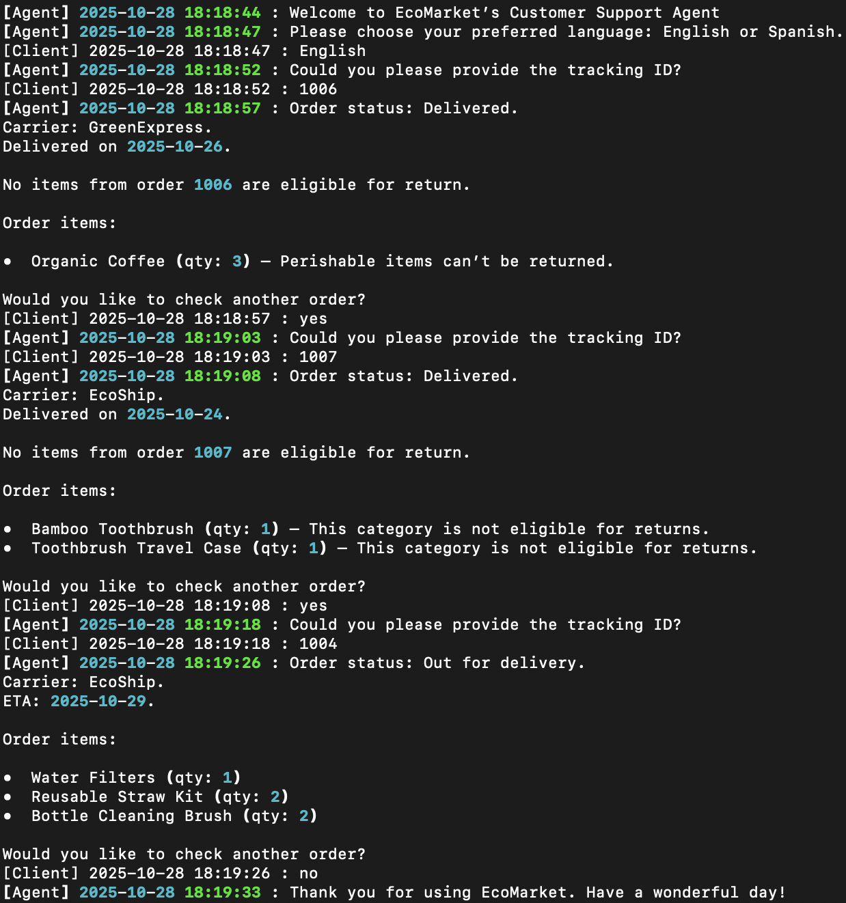
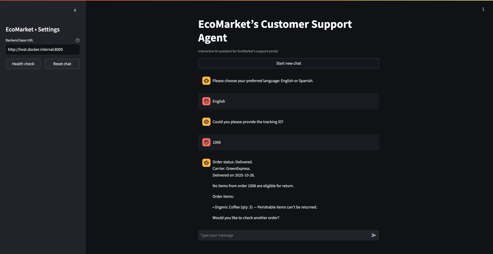

# Customer Support Agent

This repository implements a generative, agentic AI customer support solution for e-commerce platforms, designed as a fully containerized, production-ready system. The architecture combines agentic reasoning workflows and Retrieval-Augmented Generation (RAG) to deliver data-grounded, reliable, and context-aware assistance for both order inquiries and product return requests. Every output is deterministically validated to ensure factual accuracy, transparency, and operational trustworthiness across all conversational flows.

## 🛒 1. Problem Overview

Modern e-commerce operations demand fast, consistent, and intelligent customer support capable of handling diverse and context-dependent requests. Conventional chatbots based on rigid scripts or static intents cannot reason over structured business data or adapt dynamically to user context, which often leads to unresolved interactions, customer frustration, and unnecessary escalations.

This project addresses that challenge by introducing an agentic RAG-based support system that integrates autonomous reasoning, contextual retrieval, and deterministic validation within a unified agentic reasoning workflow.

Through this workflow, the system can:

- Interpret natural language queries and identify user intent with contextual awareness.
- Retrieve relevant information from both structured (Orders, Product Catalog) and unstructured (Returns Policy, FAQs) enterprise sources.
- Apply rule-based reasoning to validate return eligibility, calculate delivery timelines, and ensure compliance with policy constraints.
- Generate fully validated, policy-compliant responses before presenting them to the user.

The agent autonomously orchestrates these reasoning steps using a deterministic workflow that guarantees traceability, factual grounding, and predictable conversational behavior, providing a scalable and trustworthy foundation for AI-driven customer support.

## 🎯 2. Project Purpose

The primary goal of this project is to develop a transparent, explainable, and agentic AI support agent that operates through a controlled reasoning workflow integrating data retrieval, logical validation, and response generation. This approach ensures the agent can autonomously manage multi-step tasks while maintaining full alignment with enterprise data and governance policies.

### Core Objectives

- **Agentic Reasoning Workflow:** Implement a structured and deterministic sequence of reasoning steps including planning, retrieval, validation, and generation that governs all model outputs.
- **Retrieval-Augmented Generation (RAG):** Integrate and query enterprise data sources such as Orders, Product Catalog, Returns Policy, and FAQs to produce grounded and verifiable responses.
- **Structured Validation:** Enforce strict JSON schema validation to guarantee response completeness, type safety, and predictable conversational behavior.
- **Transparency and Governance:** Ensure every reasoning cycle is explainable, auditable, and traceable through deterministic orchestration and controlled state transitions.
- **Scalable Architecture:** Deliver the solution as a containerized microservice supporting both CLI and Web API deployments for seamless integration with broader ecosystems.

Together, these principles define a robust, auditable, and enterprise-ready foundation for deploying responsible agentic AI systems capable of reliable and policy-compliant customer support.

## 📂 3. Project Structure

The repository is organized as follows:

```
📦 customer-support-agent
├── 📄 .gitattributes                              # Git attribute and text handling rules
├── 📄 .gitignore                                  # Ignore rule definitions for Git
├── 📂 .github/workflows                           # CI/CD automation workflows
│   └── 📄 main_pipeline.yml                       # CI/CD workflow triggered on push to main
├── 📄 README.md                                   # Main repository documentation
├── 📂 customer-support-service                    # Application for interactive customer support agent
│   ├── 📄 .env                                    # Example environment configuration file
│   ├── 📄 Dockerfile                              # Dockerfile for customer support service
│   ├── 📄 README.md                               # Service documentation
│   ├── 📄 agent.py                                # Agent module logic
│   ├── 📄 app.py                                  # Core application logic
│   ├── 📄 rag.py                                  # RAG module logic
│   ├── 📄 requirements.txt                        # Python dependencies
│   ├── 📂 data                                    # Data assets
│   │   ├── 📄 faqs.md                             # Frequently asked questions document
│   │   ├── 📄 orders_db.json                      # Example customer orders dataset
│   │   ├── 📄 product_catalog_db.json             # Example product catalog dataset
│   │   └── 📄 returns_policy.md                   # Returns policy document
│   ├── 📂 images                                  # Visual assets used in documentation
│   │   ├── 📄 cli_agent_evidence.png              # Evidence of agent execution in CLI mode
│   │   └── 📄 ui_agent_evidence.png               # Evidence of agent execution in Web API mode
│   ├── 📂 prompts                                 # Prompt templates and configuration
│   │   └── 📄 settings.toml                       # Prompt configuration and system rules
│   └── 📂 tests                                   # Unit tests for customer support service
│       ├── 📄 test_agent.py                       # Unit test suite for validating agent logic and behavior
│       ├── 📄 test_customer_support.py            # Unit test suite for validating service logic and behavior
│       └── 📄 test_rag.py                         # Unit test suite for validating RAG logic and retrieval accuracy
├── 📂 ui-service                                  # Streamlit web interface for the Customer Support Agent
│   ├── 📄 .env                                    # Example environment configuration file
│   ├── 📄 Dockerfile                              # Dockerfile for UI service
│   ├── 📄 README.md                               # Service documentation
│   ├── 📄 app.py                                  # Streamlit application logic
│   └── 📄 requirements.txt                        # Python dependencies for the UI
└── 📂 docs                                        # Documentation assets
    ├── 📂 aws-configuration                       # AWS configuration and changelog
    │   ├── 📄 README.md                           # AWS configuration document
    │   └── 📄 CHANGELOG.md                        # Log of document changes and version updates
    └── 📂 customer-support-solution               # Customer support solution documentation
        ├── 📄 CHANGELOG.md                        # Log of document changes and version updates
        ├── 📄 README.md                           # Customer support solution documentation
        └── 📂 images                              # Visual assets used in documentation
            ├── 📄 solution_diagram.png            # Architecture diagram of the customer support solution
            └── 📄 agent_workflow_diagram.png      # Agent workflow diagram illustrating the reasoning pipeline
```

- `README.md`: Main repository documentation providing an overview of the system, architecture, and deployment process.
- `.github/workflows`: Contains the CI/CD automation workflows responsible for testing, building, and deploying both backend and frontend services to AWS.
- `docs`: Centralized documentation resources covering the overall system design, AWS deployment configuration, CI/CD pipeline documentation, architecture diagrams, and version changelogs.
- `customer-support-service`: Backend service implementing the agentic, generative AI customer support agent that manages order status inquiries and product return guidance.
- `ui-service`: Streamlit-based frontend interface that enables users to interact with the Customer Support Agent through a conversational chat interface connected to the backend API.

## 💻 4. Services Overview

### 4.1 Customer Support Service
**[`customer-support-service`](./customer-support-service)**

The customer support service is a Python-based backend that hosts the interactive, agentic AI support agent. It integrates a Retrieval-Augmented Generation (RAG) core with deterministic reasoning to provide accurate, policy-compliant responses to customer inquiries. The agent combines structured retrieval, validation, and reasoning steps to ensure factual, transparent, and predictable interactions.

The service handles two main conversational flows:

- **Order Status Inquiries:** Retrieves and presents structured order information, including tracking ID, items in the order, carrier, estimated delivery date (ETA), and delivery status.
- **Product Return Guidance:** Validates product eligibility and provides clear next steps based on the business rules defined in the Returns Policy, Product Catalog, and FAQs.

Its modular, extensible architecture allows seamless integration with enterprise systems such as order management platforms, policy databases, or customer-facing support portals.

### 4.2 UI Service
**[`ui-service`](./ui-service)**

The UI Service is a lightweight Streamlit-based web interface that enables direct interaction with the Customer Support Agent through a conversational chat interface. It provides a simple, responsive layout that displays real-time agent responses, monitors backend connectivity, and manages conversation state within each user session.

The frontend automatically connects to the backend service, periodically checks its health status, and offers reset functionality to start new conversations. It serves as the main user-facing layer of the overall customer support ecosystem.

Together, these services deliver a cohesive, containerized AI-powered support system that combines agentic reasoning, semantic retrieval, and responsive design to provide reliable, transparent, and human-like customer interactions.

## 🔧 5. Technologies

- **Python:** Core application logic, RAG orchestration, and agentic reasoning workflow.
- **Streamlit:** Frontend framework powering the web-based conversational interface.
- **OpenAI API:** Enables generative reasoning and natural language understanding for the agent.
- **LangChain:** Manages the Retrieval-Augmented Generation (RAG) pipeline and context retrieval orchestration.
- **Chroma Vector Database:** Provides local semantic storage for embeddings and document retrieval.
- **HuggingFace Embeddings:** Supplies multilingual vector encodings for semantic search and context alignment.
- **TOML-based configuration:** Defines system prompts, behavioral constraints, and orchestration parameters in a maintainable and auditable format.
- **Markdown knowledge sources:** Contain business policies, product documentation, and FAQs in transparent, human-readable format.
- **Pytest:** Ensures the reliability of the agentic reasoning pipeline through automated tests for retrieval integrity and conversational logic.
- **Docker:** Containerization layer for portability, reproducibility, and consistent runtime environments. 

## ✅ 6. Requirements

- **Docker** installed locally to build and run all containers.
- **Internet connection** required for image builds, dependency downloads, and model retrieval.
- A local **Chroma** vector database powers the semantic retrieval layer. The agentic Retrieval-Augmented Generation (RAG) module automatically indexes and correlates information from:
  - **Orders:** Transactional and fulfillment records used for order tracking and delivery validation.
  - **Product Catalog:** Categorized product information, including specifications, perishability attributes, and defined return windows.
  - **Returns Policy & FAQs:** Unstructured business rules defining eligibility criteria and operational exceptions.
- **LangChain** orchestrates both the retrieval layer and the agent’s decision-making workflow.
- **HuggingFace Embeddings** provide multilingual semantic encoding for cross-lingual comprehension.
- **Agentic orchestration framework** built on modern LLM infrastructure, enabling deterministic and explainable conversational outputs across sessions.
- The `customer-support-service`** must be running and reachable (`http://localhost:8000` by default) before launching the UI.
- Environment variables are configured through `.env` files to ensure modular, environment-specific deployment:
  - `OPENAI_API_KEY` — Access key for the **OpenAI API** used by the reasoning and conversational model.
  - `BACKEND_BASE_URL` — Base URL of the backend API used by the UI to communicate with the `customer-support-service`.
  - `STREAMLIT_SERVER_PORT` — Port for the Streamlit UI service (`8501` by default).
  - `STREAMLIT_SERVER_ADDRESS` — Network interface for Streamlit to listen on (`0.0.0.0` for Docker deployments).

## ⚙️ 7. Steps to Build and Run the System

### 7.1 Clone the Repository

Clone the repository to your local machine:

```bash
git clone https://github.com/dannysmp/customer-support-agent.git

cd customer-support-agent
```

### 7.2 Build and Run Services

Each service runs in its own Docker container. Build and start them sequentially as follows:

#### 7.2.1 Customer Support Service

```bash
cd customer-support-service

docker build -t customer-support-service .

docker run -p 8000:8000 --env-file ./.env customer-support-service
```

#### 7.2.2 UI Service

```bash
cd ../ui-service

docker build -t ui-service .

docker run -p 8501:8501 --env-file ./.env ui-service
```

> ⚠️ **Important**: Ensure that the backend (`customer-support-service`) is running and reachable before launching the UI (`ui-service`). The frontend depends on it to process conversations and display agent responses correctly.

### 7.3 Access the Interfaces

Once both containers are running, you can interact with the system through the following endpoints:

| Service                      | Endpoint URL                                        |
|------------------------------|-----------------------------------------------------|
| UI Service                   | [`http://localhost:8501`](http://localhost:8501)    |
| Customer Support Service     | [`http://localhost:8000`](http://localhost:8000)    |

### 7.4 Test the System

The system operates as an interactive customer support agent accessible via the CLI or the Web UI. At startup, it displays the following welcome message:

```
Welcome to EcoMarket’s Customer Support Agent
```

From that point, the conversation is managed by the agentic reasoning workflow, which orchestrates dialogue and decision-making through data-grounded retrieval and validation. The agent supports two primary interaction flows:

- **Order Status Inquiries:** Provides structured details including tracking ID, items in the order, carrier, estimated delivery date (ETA), and delivery status.
- **Product Return Guidance:** Validates product eligibility and outlines next steps based on the business rules defined in the Returns Policy and Frequently Asked Questions documents.

Each response from the model is parsed and validated being displayed to the user. This guarantees structural integrity, consistent fallbacks, and predictable behavior throughout the interaction.

The screenshot below presents an example of a live console-based session, where the agent assists the user through checking the status of an order and validates the eligibility of items for return:



Additionally, the following screenshot shows the agent integrated with the `ui-service`, demonstrating a full web-based conversational experience powered by the same agentic reasoning and validated responses:



## ❗ 8. Common Errors & Troubleshooting

When deploying or interacting with the system, you may encounter common issues. Below are the most frequent errors and their recommended resolutions.

### 8.1 Container Name Already In Use

This occurs when a container with the same name is already running or has not been properly removed.

**Solution:**

Manually remove the existing container and bring the system down cleanly:

```bash
docker rm -f <container-name>
```

Replace `<container-name>` with the actual container ID or name, which can be retrieved using `docker ps -a`.

### 8.2 Environment Variables Not Found

If the application fails to start, verify that each service has a `.env` file properly configured.

**Solution:**

Ensure that the `.env` file contains the required variables, including a valid `OPENAI_API_KEY`.

```bash
# Backend
OPENAI_API_KEY=[your_api_key_here]

# Frontend
BACKEND_BASE_URL=http://localhost:8000
STREAMLIT_SERVER_PORT=8501
STREAMLIT_SERVER_ADDRESS=0.0.0.0
```

Pass the file at runtime using:

```bash
--env-file ./.env
```

### 8.3 Port Already In Use

If a port such as `8000` or `8501` is already in use, the services will fail to bind to those ports.

**Solution:**

Identify the process using the port and stop it:

```bash
lsof -i :8000

kill <PID>
```

### 8.4 AWS, API, or Network Access Issues

The system requires stable internet connectivity to communicate with the OpenAI API and AWS services. If connectivity is unavailable or restricted, the agent may fail to generate responses or CI/CD builds may fail.

**Common symptoms:**

- `FileNotFoundError` for model or test files during CI execution.
- `403 Access Denied` or `Unable to locate credentials` errors.
- Timeout issues when performing `docker pull` or `docker push`.

**Solution:**

- Verify that all required GitHub repository secrets are properly configured (e.g., `AWS_ACCESS_KEY_ID`, `AWS_SECRET_ACCESS_KEY`, `AWS_REGION`).
- Ensure IAM users, roles, and policies are correctly attached and scoped for both GitHub Actions and EC2 roles.
- Confirm that your EC2 instance has outbound internet access and DNS resolution enabled.
- If using GitHub Actions, verify that the S3 paths and filenames in workflows match exactly with the actual bucket structure.

You can test AWS CLI access locally using:

```bash
aws s3 ls s3://your-bucket-name/
```

For CI troubleshooting, inspect credentials and current identity:

```bash
printenv | grep AWS

aws sts get-caller-identity
```

## 🔄 9. CI/CD Pipeline (GitHub Actions)

This repository includes a fully automated CI/CD pipeline powered by **GitHub Actions**, ensuring reliable validation, deployment, and synchronization of both backend and frontend services.

### 9.1 Workflow Triggers

The workflow is defined in the `.github/workflows/` directory and executes automatically on every push to the `main` branch.

It performs the following stages:

1. Executes all unit tests for the `customer-support-service` to validate conversational logic, retrieval accuracy, and reasoning integrity.
2. Builds Docker images for both the `customer-support-service` and the `ui-service`.
3. Pushes the latest images to Amazon Elastic Container Registry (ECR) under the `latest` tag.
4. Connects securely to the target AWS EC2 instance and deploys both containers via Docker.
5. Injects all required environment variables at runtime from GitHub Secrets, ensuring secure and consistent configuration across environments. These include credentials, ports, hostnames, and service URLs for both backend and frontend.
   Examples: `AWS_ACCESS_KEY_ID`, `AWS_SECRET_ACCESS_KEY`, `AWS_REGION`, `EC2_HOST`, `EC2_USER`, `EC2_SSH_KEY`, `BACKEND_PORT`, `FRONTEND_PORT`, `OPENAI_API_KEY`, and `S3_BUCKET`.
6. The backend container runs as a FastAPI application exposing `/health`, `/chat`, and `/reset` endpoints, while the frontend Streamlit interface using environment-defined variables.
7. Logs are printed to the CI console, and any failure triggers an automatic stop and cleanup of previous containers.

### 9.2 Pipeline Guarantees

This CI/CD pipeline provides the following guarantees:

- Reliable, reproducible deployments for both backend and frontend services.
- Secure integration with AWS using **GitHub Secrets** and IAM roles.
- Verified Docker builds ensuring consistent behavior and compatibility across services.
- Automated validation of service health and endpoint availability before deployment.
- Transparent and traceable logs directly visible in the GitHub Actions console.
- Automatic cleanup of old containers and image layers to maintain a clean EC2 environment.

CI/CD workflow definition:
- [`.github/workflows/main_pipeline.yml`](./.github/workflows/main_pipeline.yml)

## ☁️ 10. AWS Infrastructure Configuration

**[`docs/aws-configuration`](./docs/aws-configuration)**

To enable seamless deployment and automation, this project integrates directly with **AWS services** for container management, image storage, and runtime execution. All cloud resources are securely configured to operate with GitHub Actions using encrypted secrets and scoped IAM roles.

All provisioning details and configuration steps are described in this document, which outlines the setup of the following AWS components that support continuous integration, secure deployment, and runtime operations:

- **S3 Bucket:** Serves as centralized storage for configuration assets, logs, and artifacts required during CI/CD execution.
- **IAM Configuration:** Defines the identity and access control setup, including GitHub Actions credentials, scoped policies for S3 and ECR, and the EC2 instance role used during deployments.
- **ECR Repository:** Hosts versioned Docker images for both backend (`customer-support-service`) and frontend (`ui-service`). This enables automated builds, secure image distribution, and reliable rollback capabilities.
- **EC2 Instance:** Acts as the runtime environment for all deployed services. Docker is installed to support containerized execution and service-level isolation within the production environment.

The configuration guide also documents key operational best practices, such as:

- Enabling versioning and access control for S3 buckets.
- Applying SSH hardening and security group restrictions for EC2 access.
- Installing and configuring Docker with non-root permissions.
- Recommending IAM security patterns, including GitHub OIDC federation.

This infrastructure setup ensures secure, scalable, and fully automated deployments that integrate seamlessly with the CI/CD pipeline and AWS ecosystem.

You can access the full documentation and change history here:

- [`docs/aws-configuration/README.md`](./docs/aws-configuration/README.md)
- [`docs/aws-configuration/CHANGELOG.md`](./docs/aws-configuration/CHANGELOG.md)

## 🤖 11. Customer Support Solution

**[`docs/customer-support-solution`](./docs/customer-support-solution)**

This document provides a comprehensive reference for the proposed **Generative AI Customer Support Solution**, defining the conceptual and technical foundation of the system. It details the problem context, architectural rationale, and workflow design that support the agentic reasoning framework implemented across the platform.

The documentation also describes system behavior, strengths, limitations, and ethical considerations to ensure a responsible, transparent, and trustworthy deployment of AI-driven customer support technologies.

You can access the full documentation and change history here:

- [`docs/customer-support-solution/README.md`](./docs/customer-support-solution/README.md)
- [`docs/customer-support-solution/CHANGELOG.md`](./docs/customer-support-solution/CHANGELOG.md)


## 📦 12. Notes

- The system operates as a fully containerized, agentic customer support platform integrating both backend and frontend services. All interactions are executed deterministically within structured response contracts, ensuring traceability, stability, and reproducibility as prompts and configurations evolve.
- Orders and returns data are sourced from local reference databases to enable controlled experimentation and consistent validation of reasoning workflows:
  - `orders_db.json` contains representative order records used for tracking and delivery validation.
  - `product_catalog_db.json` defines product categories, attributes, and return window durations for eligibility evaluation.
  - `returns_policy.md` outlines the business rules governing returns and exchanges.
  - `faqs.md` provides additional clarifications and procedural guidance for common customer inquiries.
- The backend (`customer-support-service`) powers the agentic reasoning workflow, combining prompt engineering, retrieval-augmented generation, and validation layers that enforce logical consistency and factual grounding across conversations.
- The frontend (`ui-service`) provides an interactive web interface built with Streamlit. It enables users to chat with the agent in real time, perform connection health checks, manage sessions, and observe validated responses without storing any customer or conversational data locally.
- Both services communicate through REST endpoints for chat, health monitoring, and session resets, with the frontend relying on environment variables for correct backend routing.
- Execution is deterministic within the defined contracts. All model responses are validated, and any parsing or validation failure triggers a safe fallback, ensuring predictable and fault-tolerant behavior.
- Operational and security considerations:
  - The environment variable `OPENAI_API_KEY` must be defined in a `.env` file to enable authenticated access to the OpenAI API.
  - The environment variables `BACKEND_BASE_URL`, `STREAMLIT_SERVER_PORT`, and `STREAMLIT_SERVER_ADDRESS` must be configured for proper frontend connectivity.
  - No secrets are embedded in container images. All credentials must be securely injected at runtime via environment variables.
  - Containers run as non-root users to minimize exposure and enforce security best practices.
  - Data and prompt files should be mounted in read-only mode for production deployments.
  - Frontend deployments should be secured behind HTTPS using a reverse proxy (e.g., NGINX or Traefik) and restricted network access.
- Comprehensive automated tests validate all functional layers of the system, covering agentic reasoning, conversational flow correctness, and retrieval layer reliability.

Together, these safeguards guarantee that the system operates consistently, securely, and in full alignment with its agentic and data-driven design.

## 📬 13. Contact

- **Danny Martinez**
   - **Email**: danny.martinez@u.icesi.edu.co, stevenmartinez880@gmail.com