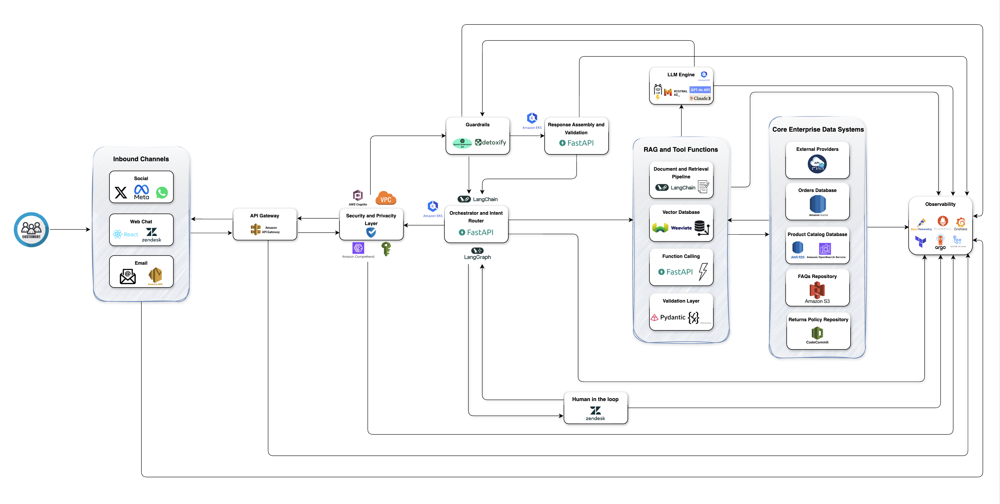
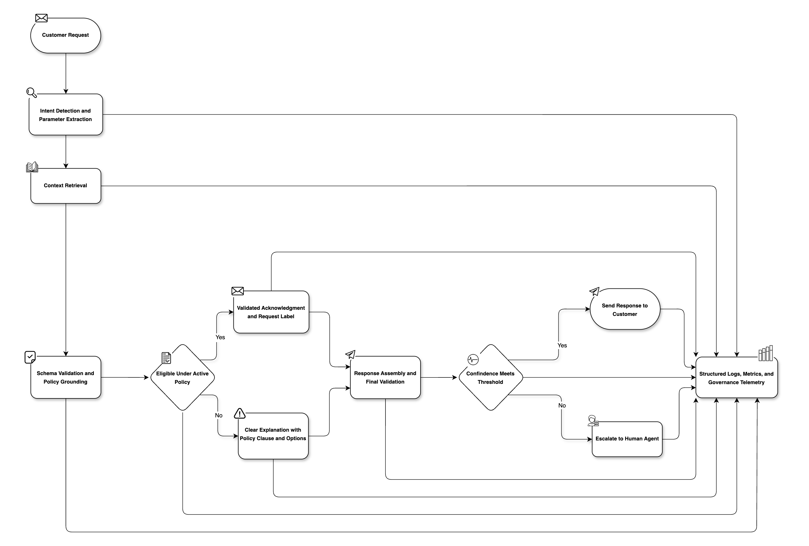

# EcoMarket - Generative AI Customer Support Solution

EcoMarket is a rapidly growing e-commerce company dedicated to offering sustainable products to a broad and expanding customer base. Despite its commercial success, the company faces significant challenges in its customer support operations. The support department receives thousands of inquiries each day through channels such as chat, email, and social media. Approximately 80 percent of these interactions consist of repetitive requests including order status, returns, and product information, while the remaining 20 percent involve complex cases such as complaints, technical issues, and customer suggestions that demand empathy and nuanced resolution. With an average response time of 24 hours, EcoMarket has identified a bottleneck that directly affects customer satisfaction and overall service quality.

This document presents a proposed generative AI solution designed to accelerate response times and enhance the quality, accuracy, and consistency of customer support. The solution integrates Retrieval-Augmented Generation with an agentic workflow that grounds every response in EcoMarket’s enterprise data and internal knowledge base, reducing hallucinations, strengthening factual accuracy, and ensuring reliability at scale. This approach aligns with the company’s mission of combining sustainability with customer-centric practices, delivering both operational efficiency and an improved overall customer experience.

## Generative AI Customer Support Solution

The selection of the most appropriate solution for EcoMarket was carried out by analyzing several critical factors including the nature of customer queries where 80 percent are repetitive and 20 percent are complex, the importance of factual accuracy in transactional responses, the need for empathy in sensitive interactions, and the technical feasibility of integrating with EcoMarket’s existing infrastructure. Considerations of cost, scalability, security, and ethical alignment also played a decisive role. Based on this analysis, the following architecture is proposed.

### Proposed Solution

The proposed solution for EcoMarket is a hybrid architecture that integrates multilingual embeddings, retrieval mechanisms, advanced language models, an agentic orchestration layer built with structured validation, and human oversight. This design ensures factual accuracy by grounding responses in EcoMarket’s enterprise data and internal knowledge base, while maintaining scalability, reliability, and a consistently high level of customer satisfaction.

First, the foundation of the solution is a multilingual embedding model optimized for Spanish and English that represents EcoMarket’s documents with high fidelity across languages. The selected model is `intfloat/multilingual-e5-base`, an open-source model available on Hugging Face that delivers strong semantic retrieval in both languages, performs efficiently on standard GPU or CPU infrastructure, and avoids vendor lock-in and per-call fees associated with proprietary APIs. By contrast, proprietary models such as OpenAI’s `text-embedding-3-large` offer excellent quality but introduce higher variable costs and tighter data dependencies. The open-source choice therefore provides a superior balance of accuracy, cost control, and governance. For the storage of embeddings, the solution adopts a unified vector database in Weaviate, applied consistently across development and production. Weaviate is selected over alternatives such as Pinecone, ChromaDB, or Milvus because it combines hybrid search, advanced filtering, horizontal scalability, and seamless operational continuity in both self-hosted and managed modes, for example filtering by product category or effective policy version date. This design establishes a reliable and cost-efficient infrastructure that scales with EcoMarket’s growth, supports efficient similarity search and high-performance retrieval, and keeps responses fluent, accurate, and firmly grounded in the company’s proprietary knowledge.

To extend this architecture toward intelligent task automation, the proposed design incorporates an agentic layer that enables the system to execute autonomous, well defined actions. This agent manages transactional workflows such as the product return process, which focuses on verifying eligibility and notifying the customer about the next steps. These capabilities are implemented through deterministic functions, including check_return_eligibility(order_id, product_id) which receives structured identifiers and returns a validated payload with eligibility status and rationale, and request_return_label(order_id, customer_contact, pickup_preference) which records the label request and returns an acknowledgment confirming that the label and detailed instructions will be securely delivered to the customer through their registered communication channel, primarily via email. Additional utilities include get_order_summary(order_id) to confirm order state and items, and fetch_policy_clause(policy_id, version) to anchor responses to the active policy text. All functions are defined with Pydantic schemas that enforce strict input and output validation, ensuring reliability, type safety, and auditable execution within the agent workflow.

Second, to support this agentic layer and ensure consistent factual grounding, the architecture incorporates a dedicated retrieval pipeline that continuously indexes EcoMarket’s enterprise data and internal knowledge base, including four key repositories that serve as complementary pillars. The order management system stores transactional information such as purchases, deliveries, and payment confirmations in a high-availability Aurora PostgreSQL database that ensures consistency and reliability. The returns policy repository, hosted in AWS CodeCommit, guarantees that all responses comply with the most recent and authoritative business rules. The product catalog is maintained in an Amazon RDS for PostgreSQL database, which provides transactional integrity and stable performance for structured product data. Additionally, an Amazon OpenSearch Service index receives a denormalized feed from the catalog database, enabling advanced search capabilities such as full-text retrieval and faceted exploration. Finally, the Frequently Asked Questions (FAQ) repository is stored in Amazon S3, capturing recurring informational queries in a concise and customer-friendly format that reduces escalation and improves clarity.

To maximize retrieval precision, all documents are segmented using advanced chunking strategies that balance granularity and semantic integrity. For example, paragraph-based segmentation is applied to policies, recursive splitting to hierarchical product descriptions, and dynamically sized chunks to structured datasets. This design ensures that fragments remain manageable in size and contextually meaningful. By combining this segmentation with the embedding process, the system constructs a robust index where each query can be matched with the most relevant and fine-grained context. This approach minimizes hallucinations, preserves factual accuracy, and enables rapid adaptation whenever new documents or policy updates are introduced.

Third, before generating a response, the system executes an agentic workflow implemented with LangGraph that structures reasoning into distinct phases of planning, execution, and validation. This process ensures that every output is grounded in the retrieved contextual fragments, maintaining factual accuracy, timeliness, and direct relevance to the customer’s query. By transforming implicit conditioning into explicit reasoning steps, the workflow serves as a safeguard against unsupported or speculative answers. Each generated response is then validated through Pydantic schemas that enforce strict compliance with predefined data formats and business rules. This validation layer guarantees consistency and reliability across interactions, while enabling comprehensive auditing, traceability, and governance. Together, these mechanisms uphold enterprise-grade standards of quality and preserve customer trust in production environments.

The orchestration framework selected for this agentic workflow is based on LangChain and LangGraph. LangChain provides the modular foundation for managing prompts, tool invocation, and retrieval, while LangGraph introduces a graph-based reasoning structure that represents the agent’s process as distinct nodes of planning, execution, and validation. This design offers a transparent and auditable control flow, ensuring that every decision taken by the AI is deterministic, explainable, and aligned with EcoMarket’s operational policies. Together, these frameworks support both the reactive behavior required for customer inquiries and the proactive execution of backend actions such as policy lookups, eligibility checks, or label generation.

The automated workflow for the return process follows a structured, transparent, and auditable reasoning sequence. When a customer initiates a return request, the agent identifies the intent, validates contextual parameters such as order and product identifiers, and retrieves the applicable policy and order data from the enterprise repositories. Based on these inputs, the orchestration layer evaluates the return conditions against the active policy and formulates a deterministic decision on eligibility. The system then provides the customer with a clear, validated response including the next procedural steps and relevant documentation through the appropriate communication channel, primarily email. Each stage of this process is recorded within the orchestration framework, ensuring traceability, reproducibility, and compliance with business and regulatory standards. This workflow embodies the principles of grounded automation, factual transparency, and responsible decision-making that guide the overall design.

Finally, for the 20 percent of complex and sensitive queries that require empathy, nuanced judgment, or conflict resolution, a Human in the Loop mechanism routes cases to customer service agents. Through an augmented agent console such as Zendesk or Freshdesk, these employees receive full context including the customer query, retrieved documents, and system suggestions, enabling them to resolve cases more efficiently while preserving a personalized and empathetic experience.

#### System Overview

The following diagram presents the architecture of the proposed customer support solution for EcoMarket. It highlights how different components interact to provide reliable, scalable, and ethically grounded automation while preserving human oversight in complex scenarios.

The diagram illustrates the end-to-end flow of a customer request, beginning with the inbound communication channels and progressing through security, orchestration, retrieval-augmented generation, and large language model serving. It shows how factual accuracy is ensured through integration with enterprise data and internal knowledge base, and how guardrails and observability layers enforce reliability, compliance, and transparency. The outbound path demonstrates how responses are validated, formatted, and returned to customers, while sensitive or ambiguous cases are escalated to human agents equipped with full contextual information. When appropriate, responses include citations or brief evidence excerpts from the retrieved sources to provide traceability and support accountable, verifiable auditing. This architecture ensures both efficiency and trust in EcoMarket’s customer support operations.

#### Agent Workflow Overview

The agent workflow for the product return process is designed as a structured, transparent, and auditable sequence that ensures factual grounding, operational safety, and full traceability of each automated decision. Its primary goal is to handle return requests efficiently while maintaining strict adherence to EcoMarket’s business rules and ethical standards. The process converts customer input into validated actions through an orchestrated sequence governed by deterministic logic and schema validation.

The following diagram illustrates the high-level agent workflow for return management, showing how the system transitions through stages of intent detection, retrieval, validation, decision-making, and communication. Each action is validated, logged, and governed by strict policies to maintain accuracy, auditability, and customer transparency.

When a customer submits a return request through a supported channel such as chat, email, or social media, the system first identifies the intent and extracts key parameters including order information, product details, and communication preferences. It then retrieves contextual data from the enterprise repositories, ensuring that every action is based on reliable and up-to-date sources. This includes policy information, order metadata, and FAQ references that provide additional context for validation.

The orchestration layer evaluates all inputs through a reasoning and validation process that determines whether the product qualifies for a return under the active policy. If the return is approved, the agent confirms eligibility and sends a validated acknowledgment to the customer. This message indicates that the return label and detailed instructions will be securely delivered through the customer’s registered communication channel, typically by email. If the product is not eligible, the agent produces a clear explanation that references the applicable policy clause and provides guidance on alternative next steps such as warranty coverage or escalation to a customer service representative.

Every step in the workflow is recorded within the orchestration framework to ensure full transparency and auditability. This record enables reproducibility and supports human oversight when confidence thresholds are not met. Human agents can review logs, verify decisions, and intervene when necessary to maintain quality and fairness. Through this combination of structured automation, factual validation, and responsible governance, the workflow guarantees reliability, explainability, and compliance across all return management operations.

### Justification

The decision to implement an agentic Retrieval-Augmented Generative AI model for EcoMarket is grounded in its ability to directly address the operational and strategic challenges identified in customer support. A purely automated solution based solely on a large proprietary LLM would introduce risks related to high costs, limited control, and potential data privacy concerns. On the other hand, a system that depends exclusively on smaller self-hosted models would be insufficient to handle the diversity and complexity of real customer queries. The proposed agentic RAG architecture provides a balanced solution by combining the reasoning capabilities of generative models with retrieval mechanisms anchored in EcoMarket’s enterprise data and internal knowledge base. In addition, it introduces a structured workflow that guides the model through explicit phases of planning, retrieval, and validation, ensuring transparency, traceability, and deterministic execution. This design minimizes weaknesses while maintaining scalability, governance, and customer trust.

LangChain and LangGraph were selected over alternative frameworks such as LlamaIndex because the combined ecosystem provides a more advanced, stable, and enterprise-ready foundation for orchestrating agentic workflows. The two frameworks complement each other by integrating modular reasoning, structured validation, and transparent control of multi-step operations. LangChain offers mature abstractions for tool registration, context management, retries, timeouts, and authorization control, which collectively ensure reliability and maintainability in production environments. LangGraph extends this foundation with a graph-based execution model that represents the agent’s reasoning process as a sequence of explicit nodes for planning, execution, and validation. This design enables deterministic checkpoints, reproducible state transitions, and safe rollbacks, ensuring that every autonomous action remains traceable and auditable.

While LlamaIndex remains a compatible and valuable option for retrieval pipelines, the LangChain and LangGraph stack was preferred for its clearer separation of responsibilities, superior integration with structured schemas, and stronger enforcement of governance mechanisms across the full lifecycle of tool invocation. The result is an architecture that not only optimizes performance and safety but also aligns with the principles of transparency, accountability, and reproducibility that define responsible AI deployment.

One of the most important advantages of this design is its ability to guarantee factual accuracy. The use of Retrieval-Augmented Generation ensures that every response is grounded in EcoMarket’s enterprise data and internal knowledge base. This eliminates the risk of misinformation and provides customers with answers that are both immediate and trustworthy. From a customer satisfaction perspective, this capability is critical, as trust in the accuracy of information is a key driver of loyalty and repeat purchases in e-commerce.

In addition, the architecture introduces a Tool and Function Calling layer that allows the AI to perform deterministic operations. This ensures that when customers request updates on an order or eligibility for a return, the system retrieves the answer directly from EcoMarket’s backend rather than generating it probabilistically. This level of operational reliability positions the solution as an enterprise-grade system capable of supporting mission-critical interactions.

Equally important is the inclusion of a Human in the Loop mechanism. Customer service remains a domain where empathy, nuanced communication, and discretionary decision-making are essential. By escalating approximately 20 percent of queries to human agents, the system ensures that automation does not compromise the quality of the customer experience. Instead, it enhances it by equipping agents with full context, enabling them to resolve issues more efficiently. This preserves the human touch while significantly reducing the workload associated with repetitive queries. In this way, the solution is not simply a cost-saving measure but a tool to empower employees and improve customer satisfaction.

Taken together, these components demonstrate that the hybrid model is not only technologically feasible but also strategically aligned with EcoMarket’s mission. It reduces response times, maintains accuracy, integrates ethical safeguards, and empowers human staff, making it a comprehensive and sustainable solution for the company’s customer support challenges.

### Cost, Scalability and Integration

Cost efficiency is one of the primary advantages of adopting a hybrid generative AI solution. By deploying small and medium instruction-tuned open-source models for the majority of interactions, EcoMarket minimizes dependency on high-cost API calls. This approach significantly reduces processing-related expenses while maintaining strong performance for routine customer service flows. The selective use of premium API-based models, such as GPT-4o or Claude 3 Opus, ensures that only the most complex or ambiguous queries incur higher costs. This tiered strategy makes the solution financially sustainable while maintaining flexibility to handle diverse customer needs.

Beyond the immediate reduction in expenses, additional cost optimizations can be achieved through model compression and hardware efficiency. Techniques such as quantization and pruning reduce the computational load, enabling efficient inference on AWS EKS worker nodes with GPU instances and caching layers for frequent retrievals. Over time, the system can be fine-tuned incrementally with EcoMarket’s historical data, further improving accuracy without requiring full retraining, which is often costly and time-intensive.

Scalability is achieved through containerized deployment on AWS EKS with horizontal pod autoscaling and node autoscaling to accommodate peak demand periods, ensuring responsiveness even during seasonal spikes such as holiday sales. Networking and security are enforced with VPC isolation and IAM for granular permissions. This design guarantees that EcoMarket can grow its customer support capacity in parallel with its overall business expansion.

Integration is streamlined through the adoption of a modular orchestration layer that abstracts the complexity of EcoMarket’s existing backend systems. The generative AI solution communicates with the Aurora PostgreSQL database that manages orders, the RDS PostgreSQL database that stores the product catalog, the AWS CodeCommit repository that holds the returns policy, and the Amazon S3 repository that stores the FAQs. OpenSearch operates as a read-only index synchronized from the catalog database to provide full-text and faceted search capabilities. The tool layer runs in FastAPI behind Amazon API Gateway, enabling efficient communication with all components without tight coupling. As a result, system upgrades or vendor changes in the backend infrastructure do not require extensive reengineering of the AI layer. Integration across customer communication channels such as chat, email, and social media is handled through APIs and middleware, ensuring a consistent and seamless omnichannel experience. Observability is provided by Prometheus, Grafana, and OpenTelemetry for real-time telemetry, monitoring, and alerting.

## Strengths, Limitations and Ethical Risks

This section presents a critical evaluation of the proposed solution. It explains expected strengths, acknowledges inherent limitations, and examines ethical risks with concrete mitigations and governance practices. The analysis considers operational performance, data and model dependencies, customer impact, and organizational implications, and it aligns the evaluation with the technologies and processes defined in the proposed architecture.

### Strengths

The solution accelerates response times for routine interactions and moves the average latency from a day to near real time in high volume queues. This improvement is achieved by combining small and medium instruction-tuned models with efficient serving on vLLM over AWS EKS and by routing only complex long-tail cases to premium models. Customers receive timely and consistent updates on orders, returns, and product information across all channels including chat, email, and social.

Grounding through Retrieval-Augmented Generation ensures factual precision and contextual reliability. Each response is anchored to EcoMarket’s enterprise data and internal knowledge base, which includes the Aurora PostgreSQL database that manages orders, the RDS PostgreSQL database that stores the product catalog, the OpenSearch index supporting advanced search capabilities, the AWS CodeCommit repository governing the returns policy, and the Amazon S3 repository containing the FAQs. All components operate under a unified orchestration layer powered by LangChain, LangGraph, and Weaviate, with Pydantic enforcing rigorous schema validation and data consistency across every tool and response. This structured framework strengthens user trust, minimizes misinformation, and upholds enterprise-grade reliability throughout the support workflow.

The Human in the Loop mechanism maintains empathy and judgment for approximately one fifth of the interactions. Agents work from an augmented console such as Zendesk or Freshdesk with full context that includes the customer message, retrieved evidence, and tool outputs. This preserves service quality while reducing repetitive workload and enables continuous learning through agent feedback.

The architecture scales horizontally on Kubernetes in AWS EKS and benefits from IAM-based security and VPC isolation. Observability with Prometheus, Grafana, and OpenTelemetry supports proactive monitoring and continuous improvement. The overall effect is higher customer satisfaction, reliable twenty-four-seven coverage, and a measurable increase in first contact resolution.

### Limitations

The system does not fully replicate human empathy or discretionary decision-making. Ambiguous or emotionally charged situations still require escalation to agents. Clear routing rules and confidence thresholds are therefore essential to avoid over-automation.

Model performance depends on the freshness and completeness of the enterprise data and internal knowledge base. Stale or inconsistent records can degrade answers even when retrieval is functioning correctly. Data stewardship, synchronization policies, and validation checks are necessary to sustain quality.

Small and medium models may struggle with lengthy multi-step reasoning or rare edge cases. Overflow to premium models increases cost and latency. This is mitigated by prompt optimization, context pruning, caching of safe snippets, and selective use of larger models only when needed.

External dependencies introduce operational risk. Outages in carrier or payment APIs can interrupt tool calls. The system must provide graceful fallbacks that acknowledge temporary unavailability, offer alternative next steps, and trigger retries without hiding errors.

### Ethical Risks

The deployment of generative AI in customer service introduces a set of ethical risks that must be managed with rigor. These risks involve the reliability of responses, fairness across customer groups, protection of personal data, and the broader implications for the workforce. Addressing these concerns is essential to ensure that the solution not only delivers operational benefits but also aligns with EcoMarket’s values of trust, sustainability, and responsibility.

**Hallucinations**

A known limitation of large language models is the tendency to generate fabricated or inaccurate information when factual context is insufficient. In a customer service environment this risk could manifest as incorrect order statuses, inaccurate return eligibility, or misleading product specifications. The solution mitigates this risk by enforcing grounding through Retrieval-Augmented Generation, by mandating the use of deterministic tool functions for transactional answers, and by validating structured outputs against predefined schemas. When uncertainty persists, the assistant defaults to transparent responses that acknowledge the limitation and escalate the query to a human agent rather than providing potentially misleading information.

**Bias and Fairness**

Generative models may replicate or amplify biases embedded in their training data, leading to inconsistencies in tone, prioritization, or resolution across different customer groups, languages, or geographies. This poses a reputational and ethical risk if some customers systematically receive less favorable service. Mitigation requires proactive measures such as inclusive prompt engineering, curated multilingual training examples, and fairness testing across diverse demographic and linguistic groups. Regular audits of resolution outcomes, refund decisions, and customer satisfaction scores allow EcoMarket to identify disparities and implement corrective actions promptly.

**Privacy and Data Protection**

Customer support involves handling sensitive information such as names, addresses, payment data, and purchase histories. If mishandled, this data could be exposed through logs, prompts, or third-party APIs, resulting in regulatory and reputational consequences. The solution enforces strict privacy safeguards including PII masking and redaction, role-based access controls, and secure authentication with OAuth2 and OIDC. Sensitive queries can be routed to self-hosted models to avoid transmitting personal data to external providers. Data minimization practices ensure that only necessary information is passed to the AI, while retention policies favor short storage lifetimes aligned with compliance frameworks such as GDPR and CCPA. Together, these measures reduce the risk of data leakage and protect customer trust.

**Labor Impact**

The introduction of AI-driven automation in customer service inevitably raises concerns about workforce displacement. While the system reduces the volume of repetitive tasks, its design positions it as a copilot rather than a replacement for human agents. The AI handles routine queries, freeing agents to focus on complex and high-value interactions, while also equipping them with contextual insights that improve efficiency and decision-making. EcoMarket’s commitment to responsible adoption includes investment in training, reskilling, and change management programs that help employees adapt to new workflows. Transparent performance metrics and employee involvement in workflow design ensure that automation empowers staff, strengthens service quality, and supports a sustainable transition rather than undermining employment.

**Security and Responsible Autonomy**

Granting the agent the capability to perform autonomous actions introduces heightened responsibilities in safety, governance, and operational control. Each action is strictly governed by policy-defined allowlists, pre-execution schema validation, and role-based authorization enforced at the orchestration layer. Any write operation requires explicit, tool-level permissions and is fully traceable through structured logging and immutable audit trails. Prior to deployment, every autonomous capability undergoes security reviews, controlled staging, and impact assessments to ensure safe operation within defined boundaries. Runtime safeguards such as kill switches and rate limiting further mitigate the scope of potential errors or misconfigurations. Collectively, these controls establish a disciplined framework that preserves the advantages of autonomy while ensuring robust operational safety, ethical accountability, and sustained organizational trust.

### Governance and Mitigations

Governance is a critical dimension of the proposed solution, ensuring that the system operates reliably, ethically, and in alignment with EcoMarket’s business objectives. It encompasses the management of prompts, data, models, and operational processes, with safeguards designed to minimize risk and maintain accountability at every stage of deployment.

Prompts and orchestration flows are maintained under strict version control and are subject to peer review before release. This practice reduces the likelihood of regressions and ensures that updates are consistent with EcoMarket’s policies and customer service standards. Continuous integration and deployment pipelines enforce automated checks on schema compliance, retrieval accuracy, and guardrail functionality prior to production deployment.

Technical guardrails are implemented across multiple layers. These include toxicity detection and personally identifiable information (PII) filters, refusal mechanisms for unsupported requests, and strict enforcement of returns policy logic. By limiting transactional responses to verified outputs from enterprise data and internal knowledge base, as well as tool functions, the system avoids speculation and ensures that responses remain trustworthy and compliant with company policies.

The observability framework guarantees continuous, policy-aligned performance of the agentic layer. Using OpenTelemetry traces, structured logs, and custom metrics exposed to Prometheus and visualized in Grafana, each decision, tool invocation, and validation event is captured with rich context. Key metrics include latency, deflection rates, escalation ratios, tool accuracy, grounding coverage, hallucination incidence, customer satisfaction, and fairness indicators across demographic and linguistic segments. Alerting thresholds and anomaly detection surface issues such as failed tool calls, delayed executions, schema validation errors, or drift in grounding coverage, enabling real-time diagnosis, root-cause analysis, and targeted remediations while preserving transparency, reliability, and compliance.

Accountability is reinforced through human oversight. Regular audits, incident reviews, and adversarial “red team” exercises are conducted to identify weaknesses, biases, or vulnerabilities that may not surface during standard operations. Findings from these reviews inform prompt refinement, retrieval corpus updates, and model selection policies. This continuous feedback loop ensures that the solution adapts to evolving customer needs while maintaining ethical and reliable performance.

Together, these governance and mitigation practices position EcoMarket’s generative AI solution as a sustainable system that safeguards customer trust, reduces operational risks, and ensures that automation enhances rather than undermines the company’s commitment to quality service and ethical practices.

### Improvement Opportunities

The proposed architecture establishes a robust foundation upon which future enhancements can be developed throughout iterative stages of the implementation. In later phases, the solution could evolve beyond the return management workflow to automate additional transactional processes that share similar data dependencies and validation requirements. For instance, the agent could be extended to create replacement orders for defective products, update customer information in the CRM, or proactively notify customers about policy updates and shipment delays. Each of these extensions would follow the same principles of deterministic execution, schema validation, and ethical oversight that define the proposed design.

Future iterations may also incorporate intelligent back-office assistance. The agent could support human operators by preparing contextual case summaries, generating draft responses, or correlating shipment and carrier data for dispute resolution. These capabilities would leverage retrieval-based grounding and structured reasoning to improve productivity while maintaining full traceability and compliance.

Continuous improvement would also apply to the underlying data and model layers. Periodic corpus updates from enterprise repositories, refinement of multilingual retrieval strategies, and adaptive document chunking would help maintain the freshness and factual reliability of the knowledge base. In addition, automated evaluation pipelines could monitor key performance metrics such as grounding accuracy, fairness across demographic groups, and tone consistency, guiding model and prompt refinement in a measurable and data-driven manner.

Looking further ahead, the system could expand across communication channels and modalities. Voice-based interfaces, multimodal understanding of receipts or shipping labels, and proactive outbound notifications would create richer and more natural interactions. Complementary optimizations in inference efficiency, including dynamic model routing and caching of deterministic snippets, would sustain performance while controlling operational costs.

Finally, the governance framework could evolve into a comprehensive observability and policy management layer, integrating red-teaming practices, bias stress tests, and feature-flagged rollouts for safe innovation. Through this roadmap, the proposed system provides not only an immediate response to EcoMarket’s customer support challenges but also a scalable path for responsible and sustained evolution.

## Conclusion

The proposed solution offers a balanced and future-oriented approach to EcoMarket’s customer service challenges. By combining instruction-tuned language models, retrieval mechanisms, deterministic tool functions, and human oversight, the system delivers efficiency without compromising empathy or accuracy. It significantly reduces response times for repetitive queries, ensures grounded and reliable answers through integration with EcoMarket’s enterprise data and internal knowledge base, and preserves human judgment for complex or sensitive cases.

The evaluation of strengths, limitations, and ethical risks demonstrates that the design is technically feasible, operationally reliable, and socially responsible. Safeguards against hallucinations, bias, and privacy violations are embedded in the architecture, while governance mechanisms ensure accountability and continuous improvement. Labor impact is addressed through a copilot model that empowers agents rather than replacing them.

Ultimately, the solution positions EcoMarket to achieve measurable improvements in deflection rate, first contact resolution, and customer satisfaction. It is financially sustainable, scalable, and seamlessly integrable with EcoMarket’s systems. Most importantly, it aligns with the company’s mission of promoting sustainability while delivering customer-centered service. This makes the generative AI framework not merely a technological innovation but a strategic capability that strengthens competitiveness, protects customer trust, and supports long-term growth. Finally, the inclusion of a structured roadmap for continuous improvement that encompasses automation expansion, operational intelligence, data and model refinement, ethical risk controls, multichannel integration, and system performance establishes a clear foundation for phased and responsible evolution while maintaining the highest standards of safety, transparency, and governance.